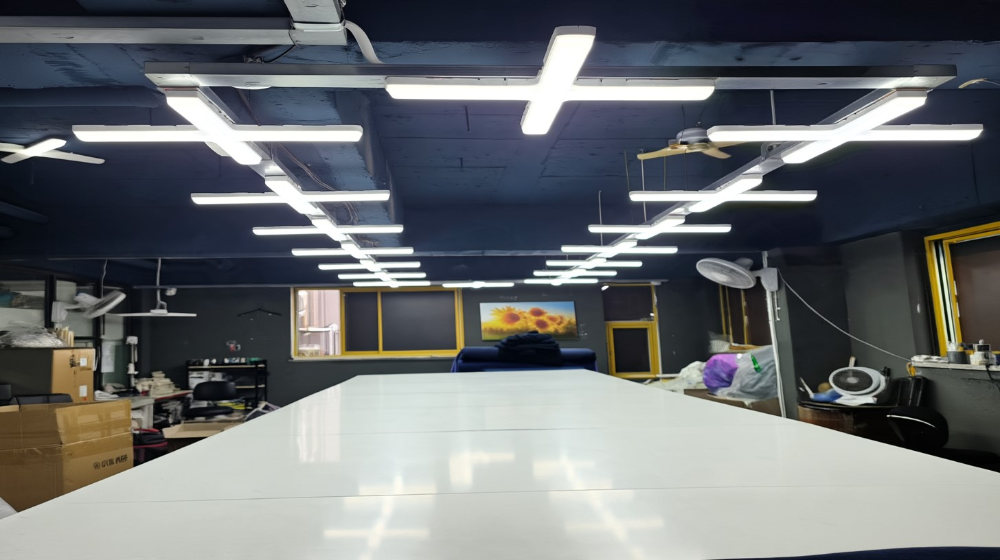
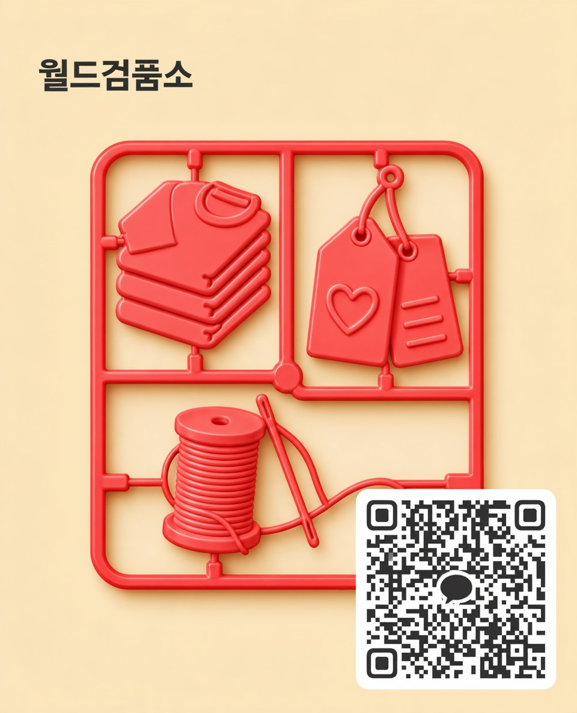

<html lang="ko">
<head>
    <meta charset="UTF-8">
    <meta name="viewport" content="width=device-width, initial-scale=1.0">
    <title>월드검품소 | World Inspection</title>
    
    <link href="https://cdnjs.cloudflare.com/ajax/libs/font-awesome/6.0.0/css/all.min.css" rel="stylesheet">
    
</head>
<body class="bg-white text-gray-800 antialiased overflow-x-hidden">

    <!-- 상단 네비게이션 바 (잘림 현상 해결) -->
    <nav class="fixed w-full z-50 top-0 bg-white shadow-md transition-all duration-300">
        

            

                

                    <i class="fas fa-check-double text-blue-900 text-3xl mr-2"></i>
                    월드검품소
                

                <!-- 메뉴 간격(space-x) 및 폰트 사이즈 반응형 적용 -->
                

                    <a href="#home" class="text-gray-600 hover:text-blue-900 font-medium text-sm lg:text-base transition duration-300 whitespace-nowrap">Home</a>
                    <a href="#about" class="text-gray-600 hover:text-blue-900 font-medium text-sm lg:text-base transition duration-300 whitespace-nowrap">About</a>
                    <a href="#services" class="text-gray-600 hover:text-blue-900 font-medium text-sm lg:text-base transition duration-300 whitespace-nowrap">Services</a>
                    <a href="#global" class="text-gray-600 hover:text-blue-900 font-medium text-sm lg:text-base transition duration-300 whitespace-nowrap">Global Export</a>
                    <a href="#contact" class="bg-blue-900 text-white px-4 lg:px-6 py-2 rounded-full font-medium hover:bg-blue-800 transition duration-300 shadow-sm text-sm lg:text-base whitespace-nowrap">Contact Us</a>
                

                <!-- Mobile menu button -->
                

                    <button class="text-gray-600 hover:text-blue-900 focus:outline-none">
                        <i class="fas fa-bars text-2xl"></i>
                    </button>
                

            

        

    </nav>

    <section id="home" class="relative pt-32 pb-20 lg:pt-48 lg:pb-32 bg-blue-50 overflow-hidden">
        

            <h1 class="text-4xl md:text-5xl lg:text-6xl font-extrabold text-blue-900 leading-tight mb-6 fade-in-up">
                성공적인 비즈니스를 위한 
                완벽한 품질 컨트롤
            </h1>
            

                수년간 축적된 노하우와 철저한 검품 시스템으로 
                고객님의 소중한 브랜드 가치를 높여드립니다.
            

            

                <a href="#contact" class="bg-blue-900 text-white px-8 py-3 rounded-full font-semibold text-lg hover:bg-blue-800 transition duration-300 shadow-lg whitespace-nowrap">의뢰 상담하기</a>
            

        

        <!-- Background decoration -->
        

        

    </section>

    <section id="about" class="py-20 bg-white">
        

            

                

                    
                

                

                    <h2 class="text-3xl md:text-4xl font-bold text-gray-900 border-b-2 border-blue-900 pb-2 inline-block">Apparel Inspection</h2>
                    

                        월드검품소는 다년간의 검품 노하우를 바탕으로, 의류 검품에 가장 최적화된 밝고 청결한 작업 환경을 구축하고 있습니다. 
                        전문 검품 인력이 투입되어 미세한 불량 하나까지 놓치지 않고 완벽하게 선별합니다.
                    

                    

                        단순한 불량 체크를 넘어 출고 전 최종 마감까지 책임지며, 최상의 퀄리티로 제품이 유통될 수 있도록 꼼꼼하게 관리합니다.
                    

                

            

        

    </section>

    <section id="services" class="py-20 bg-gray-50">
        

            

                <h2 class="text-3xl md:text-4xl font-bold text-gray-900 mb-4">체계적인 3단계 검품 시스템</h2>
                
타협 없는 기준으로 진행되는 월드검품소만의 프로세스입니다.

            

            
            

                <!-- 1단계 -->
                

                    
1

                    <h3 class="text-xl font-bold text-gray-900 mb-3">외관 및 오염 검사</h3>
                    
원단의 이색, 미세한 오염, 스크래치 등 외부적인 결함을 밝은 조명 아래서 꼼꼼하게 확인합니다.

                

                
                <!-- 2단계 -->
                

                    
2

                    <h3 class="text-xl font-bold text-gray-900 mb-3">봉제 상태 검사</h3>
                    
땀수, 땀뜀, 봉제선 틀어짐, 실밥 처리 등 전체적인 의류의 완성도와 봉제 퀄리티를 엄격하게 체크합니다.

                

                <!-- 3단계 -->
                

                    
3

                    <h3 class="text-xl font-bold text-gray-900 mb-3">포장 및 최종 확인</h3>
                    
메인 라벨 및 케어 라벨 부착 상태, 폴리백 포장 등 바이어에게 출고되기 전 마지막 상태를 완벽하게 점검합니다.

                

            

        

    </section>

    <section id="global" class="py-20 bg-white">
        

            <h2 class="text-3xl md:text-4xl font-bold text-gray-900 mb-6">해외시장을 만족시키는 하이엔드 퀄리티</h2>
            

                월드검품소는 가장 까다로운 일본 바이어들의 기준까지 완벽하게 충족시키는 정밀한 검품 서비스를 제공하고 있습니다. 
                글로벌 스탠다드에 맞춘 철저한 품질 관리 시스템을 통해 고객사의 성공적인 해외 수출과 안정적인 비즈니스를 든든하게 지원합니다.
            

        

    </section>

    <section id="contact" class="py-20 bg-blue-900">
        

            <h2 class="text-3xl md:text-4xl font-bold text-white mb-4">빠르고 간편한 상담 문의</h2>
            
스마트폰 카메라로 QR코드를 스캔하여 카카오톡으로 편하게 문의주세요.

            
            

                
                
카카오톡 채널: 월드검품소

            

        

    </section>

    <footer class="bg-gray-900 text-white py-16">
        

            
            <!-- Company Intro & Blog Link -->
            

                <h3 class="text-2xl font-bold mb-4 flex items-center tracking-tight">
                    <i class="fas fa-check-double text-blue-500 mr-2"></i>
                    월드검품소
                </h3>
                

                    최상의 품질을 향한 타협 없는 기준. 월드검품소가 고객님의 브랜드를 더욱 가치 있게 만들어 드립니다. 의뢰 상담 및 견적 문의를 환영합니다.
                

                <a href="https://blog.naver.com/world_bomun" target="_blank" rel="noopener noreferrer" class="inline-flex items-center px-4 py-2 bg-gray-800 hover:bg-[#03C75A] text-gray-300 hover:text-white text-sm font-medium rounded-lg transition-colors border border-gray-700 hover:border-[#03C75A] group shadow-sm">
                    N
                    네이버 블로그 바로가기
                </a>
            

            <!-- Contact Info -->
            

                <h4 class="text-lg font-bold mb-6 text-gray-100 border-b border-gray-700 pb-2 inline-block">Contact Info</h4>
                <ul class="text-gray-400 space-y-4">
                    <li class="flex items-start">
                        위치
                        서울특별시 성북구 지봉로 178 세경빌딩2층 월드검품소
                    </li>
                    <li class="flex items-center">
                        전화번호
                        010-7378-8322
                    </li>
                    <li class="flex items-center">
                        이메일
                        lux7101@naver.com
                    </li>
                    <li class="flex items-center">
                        시간
                        평일09:30 - 18:00
                    </li>
                </ul>
            

            
        

        
        

            &copy; 2026 월드검품소. All rights reserved.
        

    </footer>

</body>
</html>
